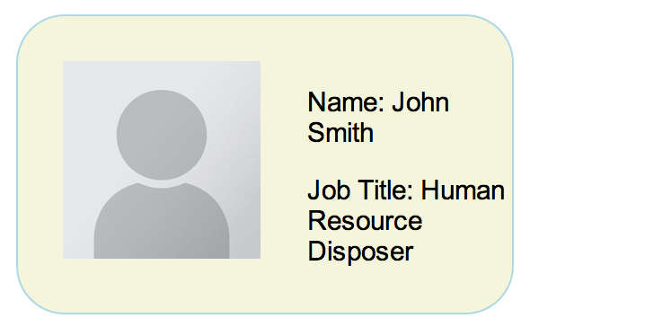

#People with (fake)Jobs
 
###*real* people with *not-so-real *jobs
  
 
 ----
  

People with (fake)Jobs is a simple one model C.R.U.D. app which employs takes in names input by the user.  Each name is then paired with a fake job/career for your entertainment.  Don't like your job? Delete yourself and randomize a new career.       
   
  

-----

Gems used

* Faker	(for new interesting careers)
* pry (for general debugging, you needn't worry about)
* rails_12factor (for deployment to [Heroku](http://www.heroku.com))

###Example

early sample reference of a card

  

a proto collaboration

source code available on [github](https://github.com/paulh1am/people_w_jobs)